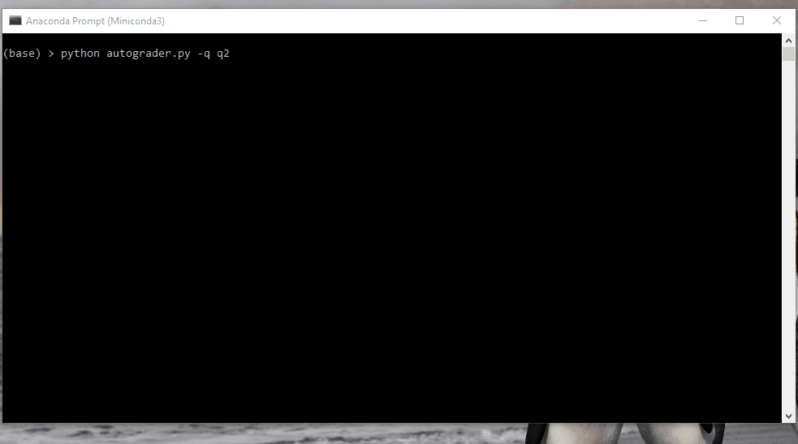
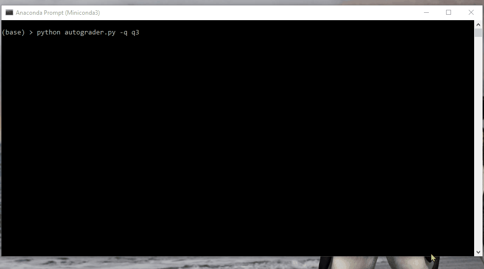
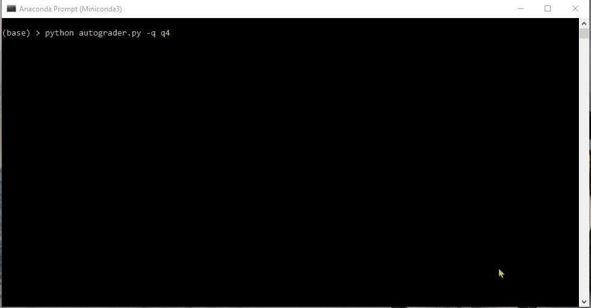

# Machine Learning

In this project, I implement neural networks for:

* Language Identification
* Handwritten Digit Classification
* Regression

# Code in Action

In this section, we can see the final results of the implementations.

## Regression

The following shows network training for a non-linear regression for approximation of sin(x) over [-2pi, 2pi]:

## Digit Classification

The following shows network training for classification of handwritten digits from the MNIST dataset.

## Language Identification

The following shows network training for language identification for one word at a time. The dataset consists of words from five languages: English, Spanish, Finnish, Dutch, Polish.

